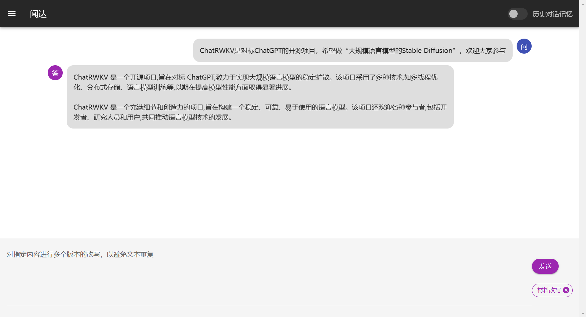

# 闻达：一个大规模语言模型调用平台
## 简介
1. 目前支持模型：`chatGLM-6B`、`chatRWKV`、`chatYuan`。
2. 知识库自动查找
3. 支持参数在线调整
4. 支持`chatGLM-6B`、`chatRWKV`流式输出和输出过程中中断
5. 自动保存对话历史至浏览器（多用户同时使用不会冲突）
6. 对话历史管理（删除单条、清空）
7. 支持局域网、内网部署和多用户同时使用。（内网部署需手动将前端静态资源切换成本地）
8. 多用户同时使用中会自动排队，并显示当前用户。

**欢迎同学们制作教学视频、懒人包等，做好请和我联系，我会把相关链接加到readme里**

**交流QQ群：162451840**
##  截图
#### 设置和预设功能

#### 预设功能使用


## 懒人包
链接：https://pan.baidu.com/s/105nOsldGt5mEPoT2np1ZoA?pwd=lyqz 

提取码：lyqz

默认参数在GTX1660Ti（6G显存）上运行良好。
1. 旧版包含程序主体和chatGLM-6B、chatYuan，分别是独立的压缩文件。
2. chatRWKV模型更新频繁，请去官方链接下最新的。暂不支持chatPDF功能，很快就加上。
3. 新版暂时只有chatGLM-6B，但重新制作，体积更新，包含各种优化，集成知识库功能，推荐使用。
## 自行安装
### 1.安装库
```pip install -r requirements.txt```
### 2.下载模型
根据需要，下载对应模型。

建议使用chatRWKV的RWKV-4-Raven-7B-v7-ChnEng-20230404-ctx2048（截止4月6日效果较好），或chatGLM-6B。

### 3.参数设置
根据`settings.bat`中说明，填写你的模型下载位置等信息
### 4.生成知识库
将txt格式的语料放到txt文件夹中，运行`run_data_processing.bat`。
## 知识库


####  chatGLM-6B模型


#### chatRWKV模型

### 1.索引语料
把自己的txt格式的文档放在名为txt的文件夹里，运行:
```run_data_processing.bat```
### 2.使用
正常使用中，勾选右上角知识库
## chatGLM-6B
运行：`run_GLM6B.bat`。

模型位置等参数：修改`settings.bat`。

默认参数在GTX1660Ti（6G显存）上运行良好。

## chatRWKV
运行：`run_rwkv.bat`。

模型位置等参数：修改`settings.bat`。

默认参数在GTX1660Ti（6G显存）上正常运行，但速度较慢。

### 生成小说

#### 文字冒险游戏

## chatYuan
YuanAPI.py

模型默认位置：ChatYuan-large-v2

这个最轻量，是电脑都能跑，但是智力差点

