# 闻达：一个大规模语言模型调用平台
针对特定环境的内容生成是LLM使用中的一项重要应用，实现这一目的，主要有`全量微调`、`lora微调`、和本项目方法。但个人没有做全量微调的，lora微调只能牺牲基础能力换单任务效果（用6B模型lora调出来的单任务效果，专门设计一个0.5B模型也能实现，且推理成本更低）。

而本项目采用知识库+auto脚本的形式为LLM提高生成能力，充分考虑个人和中小企业的资源问题，以及国内大背景下知识安全和私密性问题,实现使小模型获得近似于大模型的生成能力。
1. 目前支持模型：`chatGLM-6B`、`chatRWKV`、`chatYuan`、`llama系列`以及`openaiapi`和`chatglm130b api`，初步支持`moss`。
2. 使用知识库扩展模型所知信息，使用auto提高模型生成质量和复杂问题解决能力
3. 支持`chatGLM-6B`、`chatRWKV`、`llama系列`流式输出和输出过程中中断
4. 自动保存对话历史至浏览器（多用户同时使用不会冲突，`chatRWKV`历史消息实现方式需使用string）
5. 对话历史管理（删除单条、清空）
6. 支持局域网、内网部署和多用户同时使用。


交流QQ群：LLM使用和综合讨论群162451840；知识库使用讨论群241773574(满)；Auto开发交流群744842245；

[discussions](https://github.com/l15y/wenda/discussions)
[QQ频道](https://pd.qq.com/s/ej03plxks)

<!--ts-->
- [闻达：一个大规模语言模型调用平台](#闻达一个大规模语言模型调用平台)
  - [安装部署](#安装部署)
    - [各版本功能及安装说明](#各版本功能及安装说明)
    - [懒人包](#懒人包)
      - [百度云](#百度云)
      - [夸克](#夸克)
      - [介绍](#介绍)
    - [自行安装](#自行安装)
      - [1.安装库](#1安装库)
      - [2.下载模型](#2下载模型)
      - [3.参数设置](#3参数设置)
  - [Auto](#auto)
    - [Auto 开发函数列表](#auto-开发函数列表)
    - [Auto 开发涉及代码段](#auto-开发涉及代码段)
    - [部分内置 Auto 使用说明](#部分内置-auto-使用说明)
  - [知识库](#知识库)
    - [rtst模式](#rtst模式)
    - [fess模式](#fess模式)
    - [知识库调试](#知识库调试)
    - [清洗知识库文件](#清洗知识库文件)
  - [模型配置](#模型配置)
    - [chatGLM-6B](#chatglm-6b)
    - [chatRWKV](#chatrwkv)
      - [torch](#torch)
      - [cpp](#cpp)
    - [llama](#llama)
- [基于本项目的二次开发](#基于本项目的二次开发)
  - [wenda-webui](#wenda-webui)

<!-- Created by https://github.com/ekalinin/github-markdown-toc -->
<!-- Added by: runner, at: Sun May 14 12:45:00 UTC 2023 -->

<!--te-->
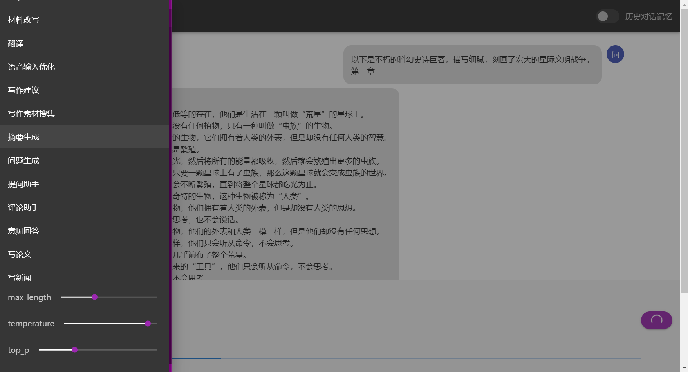
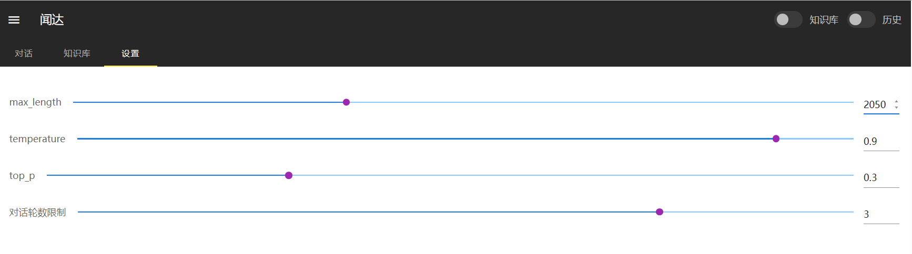
## 安装部署
### 各版本功能及安装说明
| 功能                                    | Windows懒人包                                                           | 自部署 |
| --------------------------------------- | ----------------------------------------------------------------------- | ------ |
| [知识库](#知识库) [rtst模式](#rtst模式) | 须下载模型text2vec-large-chinese                                        | 同上   |
| [知识库](#知识库) [fess模式](#fess模式) | 须安装fess                                                              | 同上   |
| [知识库](#知识库) 网络模式              | 支持                                                                    | 同上   |
| [Auto](#auto)                           | 全部支持，[部分内置Auto使用说明](#部分内置auto使用说明)                 | 同上   |
| [chatGLM-6B](#chatglm-6b)               | 支持CUDA，须自行下载模型 。可自行安装组件以支持CPU                      | 同上   |
| RWKV [torch](#torch)版                  | 全部功能支持，须自行下载模型。在安装vc后支持一键启动CUDA加速            | 同上   |
| RWKV [cpp](#cpp)版                      | 全部功能支持，须自行下载模型，也可使用内置脚本对torch版模型转换和量化。 | 同上   |
| replit                                  | 支持，须自行下载模型。                                                  | 同上   |
| chatglm130b api                         | 支持，须设置自己的key                                                   | 支持   |
| openai api                              | 支持，须设置自己的key                                                   | 支持   |
| [llama](#llama).cpp                     | 不支持                                                                  | 支持   |
| moss                                    | 不支持                                                                  | 支持   |
### 懒人包
#### 百度云
链接：https://pan.baidu.com/s/105nOsldGt5mEPoT2np1ZoA?pwd=lyqz 

提取码：lyqz
#### 夸克
链接：https://pan.quark.cn/s/c4cb08de666e
提取码：4b4R
#### 介绍
默认参数在6G显存设备上运行良好。最新版懒人版已集成一键更新功能，建议使用前更新。

使用步骤（以glm6b模型为例）：
1. 下载懒人版主体和模型，模型可以用内置脚本从HF下载，也可以从网盘下载。
2. 如果没有安装`CUDA11.8`，从网盘下载并安装。
3. 双击运行`运行GLM6B.bat`。
4. 如果需要生成离线知识库，参考 [知识库](#知识库)。
### 自行安装
PS:一定要看[example.config.yml](https://github.com/l15y/wenda/blob/main/example.config.yml)，里面对各功能有更详细的说明！！！
#### 1.安装库
通用依赖：```pip install -r requirements.txt```
根据使用的 [知识库](#知识库)进行相应配置

#### 2.下载模型
根据需要，下载对应模型。

建议使用chatRWKV的RWKV-4-Raven-7B-v11，或chatGLM-6B。

#### 3.参数设置
把[example.config.yml](https://github.com/l15y/wenda/blob/main/example.config.yml)重命名为`config.yml`，根据里面的参数说明，填写你的模型下载位置等信息

## Auto
auto功能通过JavaScript脚本实现，使用油猴脚本或直接放到`autos`目录的方式注入至程序，为闻达附加各种自动化功能。

### Auto 开发函数列表
| 函数 （皆为异步调用）           | 功能                                    | 说明                                                                |
| ------------------------------- | --------------------------------------- | ------------------------------------------------------------------- |
| send(s,keyword = "",show=true) | 发送信息至LLM，返回字符串为模型返回值 | s：输入模型文本；keyword:聊天界面显示文本；show：是否在聊天界面显示 |
| add_conversation(role, content) | 添加会话信息                          | role：'AI'、'user'；content：字符串                                 |
| save_history()                 | 保存会话历史                          | 对话完成后会自动保存，但手动添加的对话须手动保存                    |
| find(s, step = 1)              | 从知识库查找                          | 返回json数组                                                        |
| find_dynamic(s,step=1,paraJson) | 从动态知识库查找；参考闻达笔记Auto      | paraJson：{libraryStategy:"sogowx:3",maxItmes:2}                    |
| zsk(b=true)                    | 开关知识库                            |                                                                     |
| lsdh(b=true)                   | 开关历史对话                          | 打开知识库时应关闭历史                                              |
| speak(s)                       | 使用TTS引擎朗读文本。                   | 调用系统引擎                                                        |
| copy(s)                        | 使用浏览器`clipboard-write`复制文本   | 需要相关权限                                                        |
### Auto 开发涉及代码段
在左侧功能栏添加内容：
```
func.push({
    name: "名称",
    question: async () => {
        let answer=await send(app.question)
        alert(answer)
    },
})
```
在下方选项卡添加内容：
```
app.plugins.push({ icon: 'note-edit-outline', url: "/static/wdnote/index.html" })
```
在指定RTST知识库查找:
```
find_in_memory = async (s, step, memory_name) => {
   response = await fetch("/api/find_rtst_in_memory", {
      method: 'post',
      body: JSON.stringify({
         prompt: s,
         step: step,
         memory_name: memory_name
      }),
      headers: {
         'Content-Type': 'application/json'
      }
   })
   let json = await response.json()
   console.table(json)
   app.zhishiku = json
   return json
}
```
上传至指定RTST知识库:
```
upload_rtst_zhishiku = async (title, txt,memory_name) => {
   response = await fetch("/api/upload_rtst_zhishiku", {
      method: 'post',
      body: JSON.stringify({
         title: title,
         txt: txt,
         memory_name: memory_name
      }),
      headers: { 'Content-Type': 'application/json' }
   })
   alert(await response.text())
}
```
保存指定RTST知识库:
```
save_rtst = async (memory_name) => {
   response = await fetch("/api/save_rtst_zhishiku", {
      method: 'post',
      body: JSON.stringify({
         memory_name: memory_name
      }),
      headers: { 'Content-Type': 'application/json' }
   })
   alert(await response.text())
}
```
访问SD_agent:
```
response = await fetch("/api/sd_agent", {
   method: 'post',
   body: JSON.stringify({
         prompt: `((masterpiece, best quality)), photorealistic,` + Q,
         steps: 20,
         // sampler_name: "DPM++ SDE Karras",
         negative_prompt: `paintings, sketches, (worst quality:2), (low quality:2), (normal quality:2), lowres, normal quality, ((monochrome)), ((grayscale)), skin spots, acnes, skin blemishes, age spot, glans`
   }),
   headers: {
         'Content-Type': 'application/json'
   }
})
try {
   let json = await response.json()
   add_conversation("AI", '")
} catch (error) {
   alert("连接SD API失败，请确认已开启agents库，并将SD API地址设置为127.0.0.1:786")
}
```
### 部分内置 Auto 使用说明
| 文件名               | 功能                                                                                |
| -------------------- | ----------------------------------------------------------------------------------- |
| 0-write_article.js   | 写论文：根据题目或提纲写论文                                                        |
| 0-zsk.js             | 知识库增强和管理                                                                    |
| face-recognition.js  | 纯浏览器端人脸检测：通过识别嘴巴开合，控制语音输入。因浏览器限制，仅本地或TLS下可用 |
| QQ.js                | QQ机器人:配置过程见文件开头注释                                                     |
| block_programming.js | 猫猫也会的图块化编程:通过拖动图块实现简单Auto功能                                   |
| 1-draw_use_SD_api.js | 通过agents模块（见example.config.yml`<Library>`）调用Stable Diffusion接口绘图       |

以上功能主要用于展示auto用法，进一步能力有待广大用户进一步发掘。

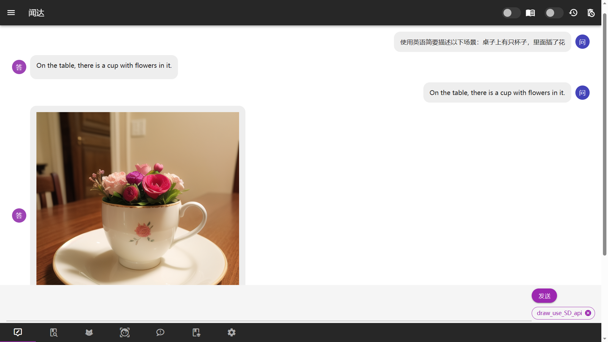
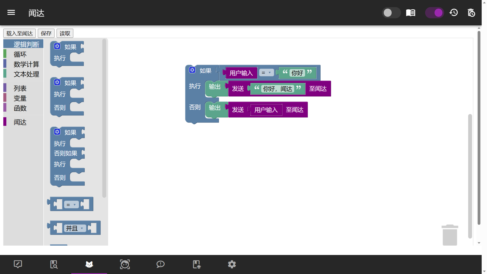
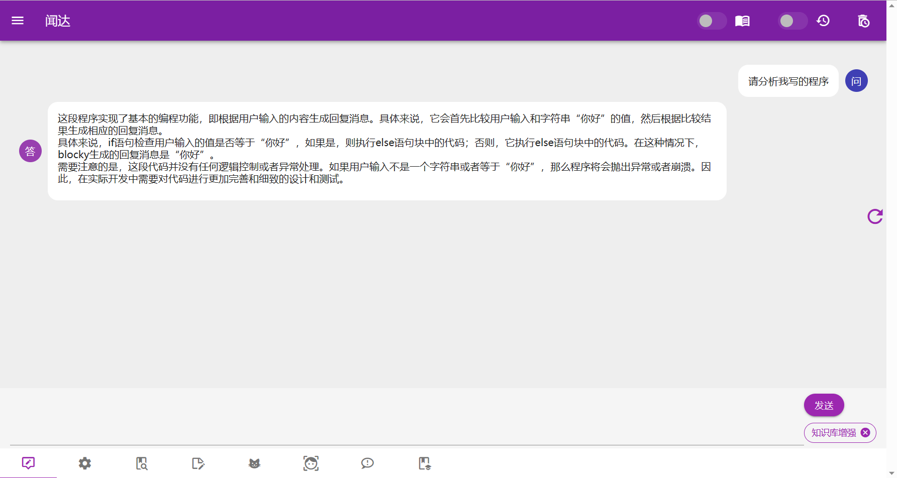

[auto例程](https://github.com/l15y/wenda/tree/main/autos)

## 知识库
知识库原理是在搜索后，生成一些提示信息插入到对话里面，知识库的数据就被模型知道了。[rtst模式](#rtst模式)计算语义并在本地数据库中匹配；[fess模式](#fess模式)（相当于本地搜索引擎）、bing模式均调用搜索引擎搜索获取答案。

为防止爆显存和受限于模型理解能力，插入的数据不能太长，所以有字数和条数限制，这一问题可通过知识库增强Auto解决。

正常使用中，勾选右上角知识库即开启知识库。
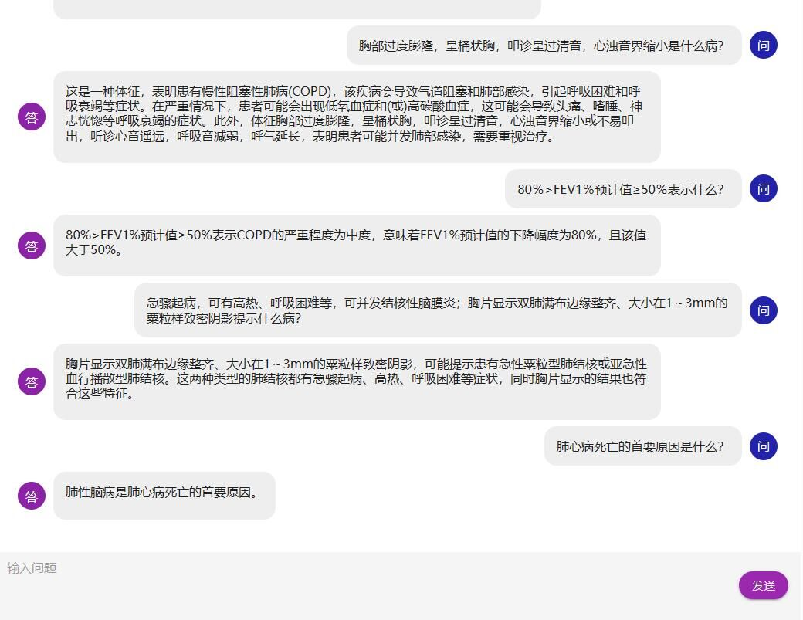
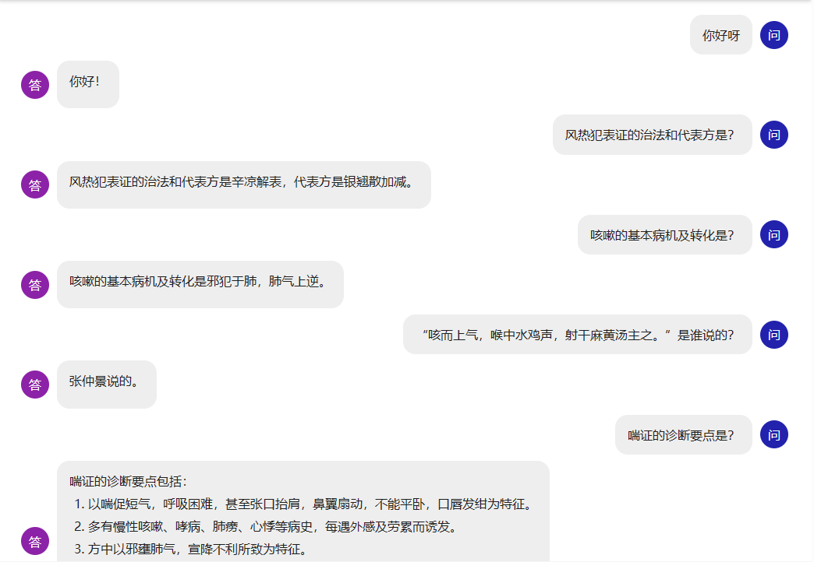


有以下几种方案：
1.   rtst模式，sentence_transformers+faiss进行索引，支持预先构建索引和运行中构建。
2.   bing模式，cn.bing搜索，仅国内可用
3.   bingsite模式，cn.bing站内搜索，仅国内可用
4.   fess模式，本地部署的[fess搜索](https://github.com/codelibs/fess)，并进行关键词提取
### rtst模式
sentence_transformers+faiss进行索引、匹配，并连同上下文返回。目前支持txt和pdf格式。

支持预先构建索引和运行中构建，其中，预先构建索引强制使用`cuda`，运行中构建根据`config.yml`(复制[example.config.yml](https://github.com/l15y/wenda/blob/main/example.config.yml))中`rtst`段的`device(embedding运行设备)`决定，对于显存小于12G的用户建议使用`CPU`。

Windows预先构建索引运行：`plugins/buils_rtst_default_index.bat`。

Linux直接使用wenda环境执行 `python plugins/gen_data_st.py`

需下载模型[GanymedeNil/text2vec-large-chinese](https://huggingface.co/GanymedeNil/text2vec-large-chinese)置于model文件夹，并将txt格式语料置于txt文件夹。


### fess模式
在本机使用默认端口安装fess后可直接运行。否则需修改`config.yml`(复制[example.config.yml](https://github.com/l15y/wenda/blob/main/example.config.yml))中`fess_host`的`127.0.0.1:8080`为相应值。[FESS安装教程](install_fess.md)
###  知识库调试
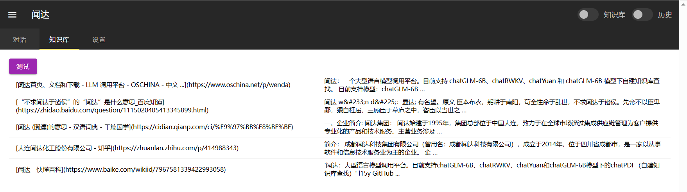
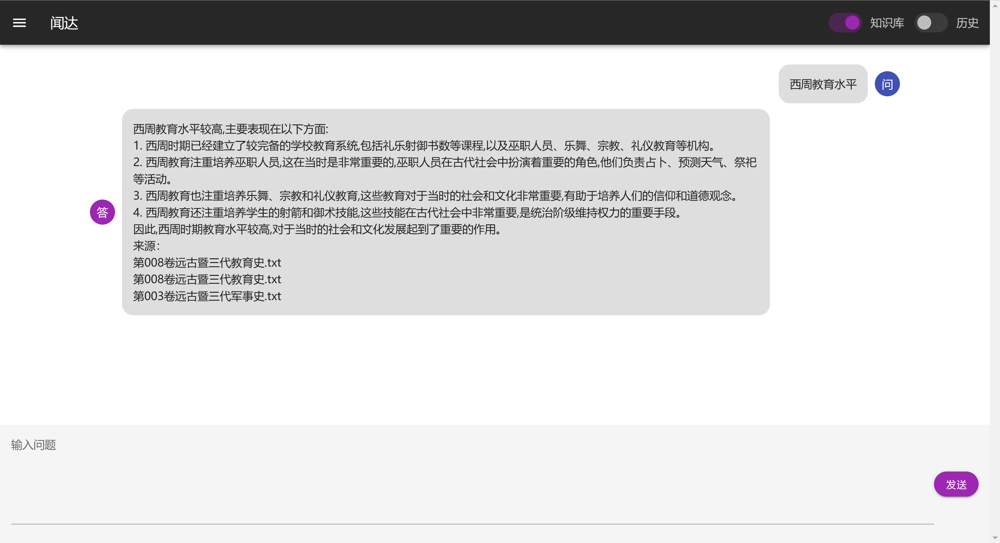
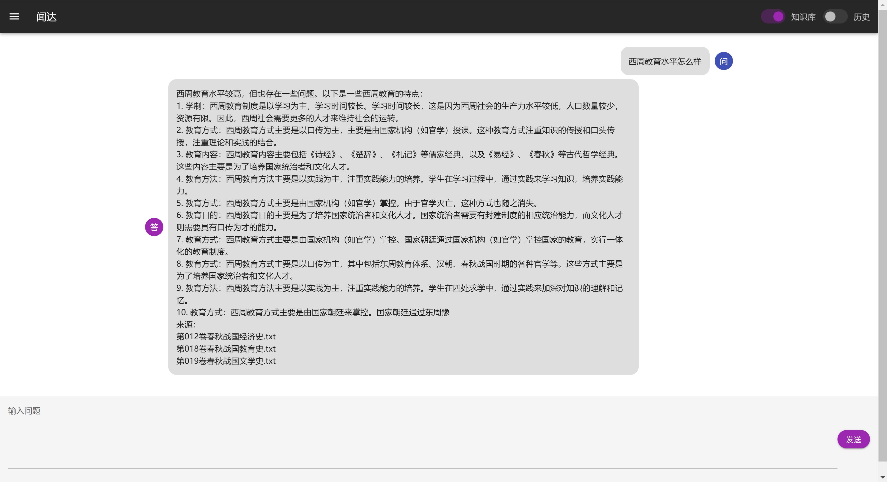

### 清洗知识库文件

安装 [utool](https://u.tools/) 工具，uTools 是一个极简、插件化的桌面软件，可以安装各种使用 nodejs 开发的插件。您可以使用插件对闻达的知识库进行数据清洗。请自行安装以下推荐插件：

- 插件“解散文件夹”，用于将子目录的文件移动到根目录，并删除所有子目录。
- 插件“重复文件查找”，用于删除目录中的重复文件，原理是对比文件 md5。
- 插件“文件批量重命名”，用于使用正则匹配和修改文件名，并将分类后的文件名进行知识库的分区操作。

##  模型配置
### chatGLM-6B
运行：`run_GLM6B.bat`。

模型位置等参数：修改`config.yml`(复制[example.config.yml](https://github.com/l15y/wenda/blob/main/example.config.yml))。

默认参数在GTX1660Ti（6G显存）上运行良好。

### chatRWKV
支持torch和cpp两种后端实现，运行：`run_rwkv.bat`。

模型位置等参数：见`config.yml`(复制[example.config.yml](https://github.com/l15y/wenda/blob/main/example.config.yml))。
#### torch
可使用内置脚本对模型量化，运行：`cov_torch_rwkv.bat`。此操作可以加快启动速度。

在安装vc后支持一键启动CUDA加速，运行：`run_rwkv_with_vc.bat`。强烈建议安装！！！
#### cpp
可使用内置脚本对torch版模型转换和量化。 运行：`cov_ggml_rwkv.bat`。

设置strategy诸如"Q8_0->8"即支持量化在cpu运行，速度较慢，没有显卡或者没有nvidia显卡的用户使用。

注意：默认windows版本文件为AVX2，默认Liunx版本文件是在debian sid编译的，其他linux发行版本未知。

可以查看：[saharNooby/rwkv.cpp](https://github.com/saharNooby/rwkv.cpp)，下载其他版本，或者自行编译。

### llama
运行：`run_llama.bat`。

模型位置等参数：见`config.yml`(复制[example.config.yml](https://github.com/l15y/wenda/blob/main/example.config.yml))。

# 基于本项目的二次开发
## [wenda-webui](https://github.com/AlanLee1996/wenda-webui)
项目调用闻达的 api 接口实现类似于 new bing 的功能。 技术栈：vue3 + element-plus + ts
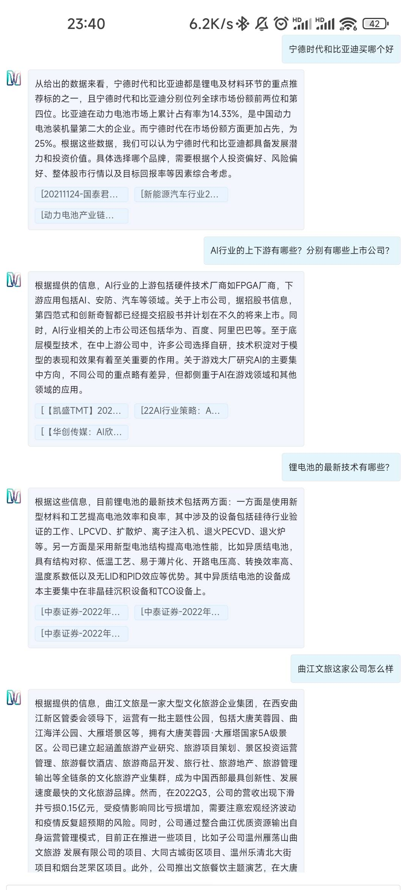

[](https://star-history.com/#l15y/wenda&Date)
